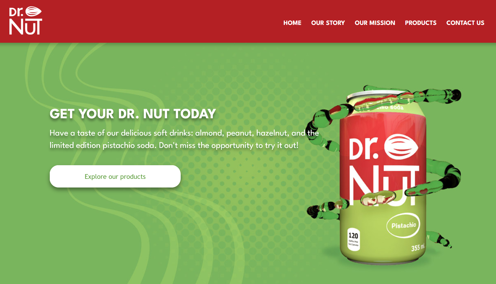

**Objective:** The goal of this project was to rebrand Dr. Nut and incorporate concepts learned in class such as: website planning with XD, content creation with Illustrator and Photoshop, model creation with Cinema4D, dynamic content with Javascript and responsiveness with CSS and HTML.

## Installation
No installation required

## Usage
Just enjoy!

## Contributing
1. Fork it!
2. Create your feature branch: `git checkout -b my-new-feature`
3. Commit your changes: `git commit -am 'Add some feature'`
4. Push to the branch: `git push origin my-new-feature`
5. Submit a pull request :D

## History

March 2024, April 2024

## Credits
Jenifer Quelali Evangelista

## License
MIT